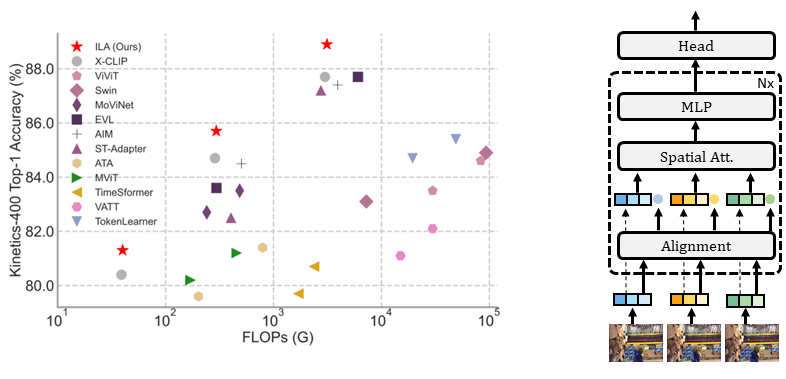

# Implicit Temporal Modeling with Learnable Alignment for Video Recognition

This is an official implementation of [ILA](https://arxiv.org/abs/), a new temporal modeling method for video action recognition.

> [**Implicit Temporal Modeling with Learnable Alignment for Video Recognition**](https://arxiv.org/abs/)<br>
> Shuyuan Tu, [Qi Dai](https://scholar.google.com/citations?user=NSJY12IAAAAJ), [Zuxuan Wu](https://zxwu.azurewebsites.net/), [Zhi-Qi Cheng](https://scholar.google.com/citations?user=uB2He2UAAAAJ), [Han Hu](https://ancientmooner.github.io/), [Yu-Gang Jiang](https://fvl.fudan.edu.cn/)

[[arxiv]](https://arxiv.org/abs/)


<div align="center">
    
</div>

    
# Environment Setup
To set up the environment, you can easily run the following command:
```
pip install torch==1.11.0
pip install torchvision==0.12.0
pip install pathlib
pip install mmcv-full
pip install decord
pip install ftfy
pip install einops
pip install termcolor
pip install timm
pip install regex
```

Install Apex as follows
```
git clone https://github.com/NVIDIA/apex
cd apex
pip install -v --disable-pip-version-check --no-cache-dir --global-option="--cpp_ext" --global-option="--cuda_ext" ./
```

# Data Preparation

For downloading the Kinetics datasets, you can refer to [mmaction2](https://github.com/open-mmlab/mmaction2/blob/master/tools/data/kinetics/README.md) or [CVDF](https://github.com/cvdfoundation/kinetics-dataset). For [Something-Something v2](https://developer.qualcomm.com/software/ai-datasets/something-something), you can get them from the official website.

Due to limited storage, we decord the videos in an online fashion using [decord](https://github.com/dmlc/decord).

We provide the following way to organize the dataset:

- **Standard Folder:** For standard folder, put all videos in the `videos` folder, and prepare the annotation files as `train.txt` and `val.txt`. Please make sure the folder looks like this:
    ```Shell
    $ ls /PATH/TO/videos | head -n 2
    a.mp4
    b.mp4

    $ head -n 2 /PATH/TO/train.txt
    a.mp4 0
    b.mp4 2

    $ head -n 2 /PATH/TO/val.txt
    c.mp4 1
    d.mp4 2
    ```

# Train
The training configurations lie in `configs`. For example, you can run the following command to train ILA-ViT-B/16 with 8 frames on Something-Something v2.
```
python -m torch.distributed.launch --nproc_per_node=8 main.py -cfg configs/ssv2/16_8.yaml --output /PATH/TO/OUTPUT --accumulation-steps 8
```

**Note:**
- We recommend setting the total batch size to 256. 
- Please specify the data path in config file(`configs/*.yaml`). For standard folder, set that to `/PATH/TO/videos` naturally.
- The pretrained CLIP is specified by using `--pretrained /PATH/TO/PRETRAINED`.

# Test
For example, you can run the following command to validate the ILA-ViT-B/16 with 8 frames on Something-Something v2.
```
python -m torch.distributed.launch --nproc_per_node=8 main.py -cfg configs/ssv2/16_8.yaml --output /PATH/TO/OUTPUT --only_test --resume /PATH/TO/CKPT --opts TEST.NUM_CLIP 4 TEST.NUM_CROP 3
```

**Note:**
- According to our experience and sanity checks, there is a reasonable random variation about accuracy when testing on different machines.
- There are two parts in the provided logs. The first part is conventional training followed by validation per epoch with single-view. The second part refers to the multiview (3 crops x 4 clips) inference logs.


# Main Results in paper
This is an original-implementation for open-source use. In the following table we report the accuracy in original paper.
- Fully-supervised on Kinetics-400:

    | Model | Input | Top-1 Acc.(%) | Top-5 Acc.(%)| ckpt | log |
    |--|--|--|--|--|--|
    | ILA-B/32 | 8x224 | 81.3 | 95.0 | [GoogleDrive](https://github.com/nbl97/X-CLIP_Model_Zoo/releases/download/v1.0/k400_32_8.pth) | [GoogleDrive](https://github.com/nbl97/X-CLIP_Model_Zoo/releases/download/v1.0/k400_32_8.txt)|
    | ILA-B/32 | 16x224 | 82.4 | 95.8 | [GoogleDrive](https://github.com/nbl97/X-CLIP_Model_Zoo/releases/download/v1.0/k400_32_16.pth) | [GoogleDrive](https://github.com/nbl97/X-CLIP_Model_Zoo/releases/download/v1.0/k400_32_16.txt) |
    | ILA-B/16 | 8x224 | 84.0 | 96.6 | [GoogleDrive](https://github.com/nbl97/X-CLIP_Model_Zoo/releases/download/v1.0/k400_16_8.pth) | [GoogleDrive](https://github.com/nbl97/X-CLIP_Model_Zoo/releases/download/v1.0/k400_16_8.txt) |
    | ILA-B/16 | 16x224 | 85.7 | 97.2 | [GoogleDrive](https://github.com/nbl97/X-CLIP_Model_Zoo/releases/download/v1.0/k400_16_16.pth) | [GoogleDrive](https://github.com/nbl97/X-CLIP_Model_Zoo/releases/download/v1.0/k400_16_16.txt)|
    | ILA-B/14 | 8x224 | 88.0 | 98.1 | [GoogleDrive](https://drive.google.com/file/d/1NUOImq0o5DlQTST17iIP3vG7DgmHQuCx/view?usp=sharing) | [GoogleDrive](https://github.com/nbl97/X-CLIP_Model_Zoo/releases/download/v1.0/k400_14_8.txt)|
    | ILA-B/14 | 16x336 | 88.9 | 97.8 |[GoogleDrive](https://drive.google.com/file/d/1FOYgnJc097OJ4lGwtRCCydQyVPJEOH7d/view?usp=sharing)  |[GoogleDrive](https://github.com/nbl97/X-CLIP_Model_Zoo/releases/download/v1.0/k400_14_16_336.txt) |

- Fully-supervised on Something-Something v2:

    | Model | Input | Top-1 Acc.(%) | Top-5 Acc.(%)| ckpt | log |
    |--|--|--|--|--|--|
    | ILA-B/16 | 8x224 | 65.0 | 89.2 | [Github](https://github.com/nbl97/X-CLIP_Model_Zoo/releases/download/v1.0/k600_16_8.pth) | [Github](https://github.com/nbl97/X-CLIP_Model_Zoo/releases/download/v1.0/k600_16_8.txt)|
    | ILA-B/16 | 16x224 | 66.8 | 90.3 | [Github](https://github.com/nbl97/X-CLIP_Model_Zoo/releases/download/v1.0/k600_16_16.pth) | [Github](https://github.com/nbl97/X-CLIP_Model_Zoo/releases/download/v1.0/k600_16_16.txt) |
    | ILA-L/14 | 8x224 | 67.8 | 90.5 | [GoogleDrive](https://drive.google.com/file/d/1FV8C1INuM91sLAN4ImjzePLIlpMSihwV/view?usp=sharing) | [Github](https://github.com/nbl97/X-CLIP_Model_Zoo/releases/download/v1.0/k600_14_8.txt) |
    | ILA-L/14 | 16x336 | 70.6 | 93.1 | [GoogleDrive](https://drive.google.com/file/d/1FV8C1INuM91sLAN4ImjzePLIlpMSihwV/view?usp=sharing) | [Github](https://github.com/nbl97/X-CLIP_Model_Zoo/releases/download/v1.0/k600_14_8.txt) |


# Bibtex
If this project is useful for you, please consider citing our paper :
```
@article{ILA,
  title={Implicit Temporal Modeling with Learnable Alignment for Video Recognition},
  author={Tu, Shuyuan and Dai, Qi and Wu, Zuxuan and Cheng, Zhi-Qi and Hu, Han and Jiang, Yu-Gang},
  journal={arXiv preprint arXiv:},
  year={2023}
}
```
# Acknowledgements
Parts of the codes are borrowed from [mmaction2](https://github.com/open-mmlab/mmaction2), [Swin](https://github.com/microsoft/Swin-Transformer) and [X-CLIP](https://github.com/microsoft/VideoX/tree/master/X-CLIP). Sincere thanks to their wonderful works.